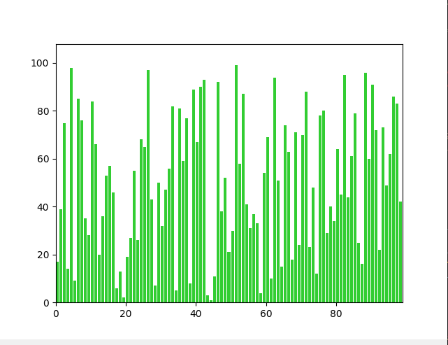
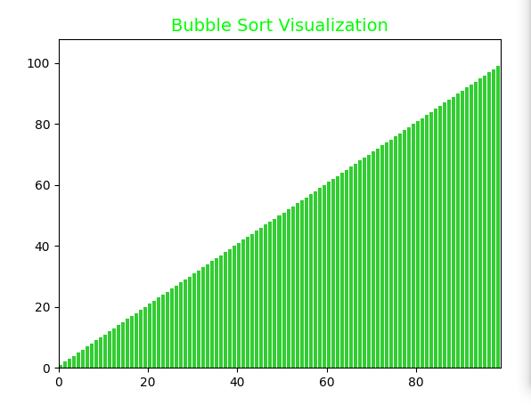
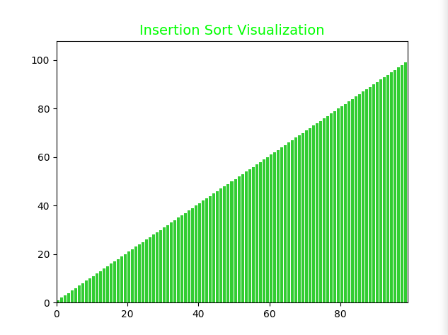
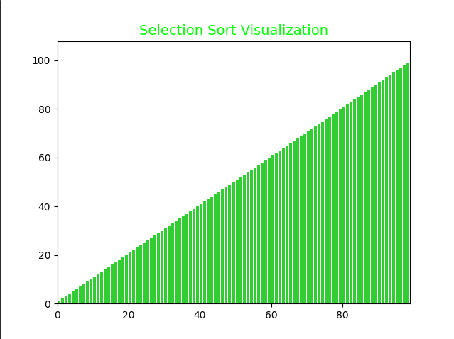
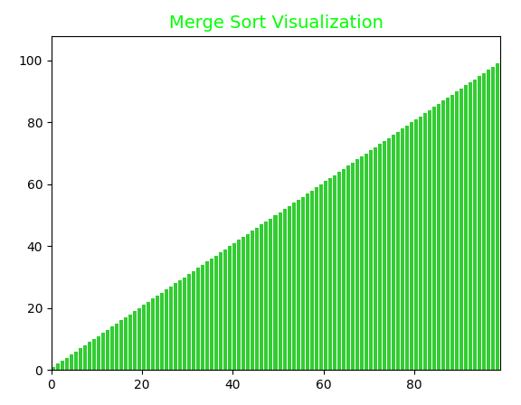

# Veri Sıralama Algoritmalarının Performans Analizi

**Yazar:** Mahmut Sibal
**Tarih:** 08.10.2025

---

## 1. Özet

Bu çalışma, bilgisayar bilimlerinin temel konularından olan sıralama algoritmalarından dört tanesinin (Bubble Sort, Insertion Sort, Selection Sort, Merge Sort) performansını analiz etmektedir. Algoritmalar, rastgele oluşturulmuş bir veri kümesi üzerinde çalıştırılmış ve tamamlanma süreleri ölçülmüştür. Bu rapor, algoritmaların teorik karmaşıklıkları ile pratik uygulama sonuçları arasındaki ilişkiyi incelemeyi ve sıralama algoritmalarının farklı senaryolardaki etkinliklerini karşılaştırmayı amaçlamaktadır.

---

## 2. Metodoloji

### 2.1. Veri Kümesi

Analizde, 1'den 99'a kadar olan tam sayıları içeren ve rastgele karıştırılmış bir veri kümesi kullanılmıştır. Veri kümesinin başlangıçtaki sıralanmamış hali aşağıdaki gibidir:

**Şekil 1: Karışık Veri Kümesi**

### 2.2. Uygulama ve Ortam

Sıralama algoritmaları Python programlama dili kullanılarak `data.py` dosyasında implemente edilmiştir. Algoritmaların çalışma adımları, `matplotlib` kütüphanesi kullanılarak görsel animasyonlara dönüştürülmüştür. Testler, standart bir kullanıcı bilgisayarında gerçekleştirilmiştir ve süre ölçümleri bu ortamda yapılmıştır.

---

## 3. İncelenen Sıralama Algoritmaları

### 3.1. Bubble Sort (Kabarcık Sıralaması)

En basit sıralama algoritmalarından biridir. Liste üzerinde sürekli olarak gezinerek bitişik elemanları karşılaştırır ve yanlış sıradaysalar yerlerini değiştirir. Bu işlem, hiç yer değiştirme yapılmayana kadar devam eder. Genellikle eğitim amaçlı kullanılır ve büyük veri setleri için verimsizdir.

**Şekil 2: Bubble Sort Sonucu**

### 3.2. Insertion Sort (Araya Ekleme Sıralaması)

Sıralanmamış kısımdaki her bir elemanı alır ve sıralanmış kısımdaki doğru yerine yerleştirir. Bu algoritma, küçük veri kümeleri veya neredeyse sıralı listeler için oldukça verimlidir.

**Şekil 3: Insertion Sort Sonucu**

### 3.3. Selection Sort (Seçmeli Sıralama)

Listenin sıralanmamış kısmındaki en küçük (veya en büyük) elemanı bulur ve sıralanmamış kısmın başındaki elemanla yer değiştirir. Bu işlemi liste tamamen sıralanana kadar tekrar eder.

**Şekil 4: Selection Sort Sonucu**

### 3.4. Merge Sort (Birleştirme Sıralaması)

"Böl ve Yönet" (Divide and Conquer) stratejisine dayanan verimli bir sıralama algoritmasıdır. Listeyi tekrar tekrar ikiye böler, tek elemanlı listeler elde edene kadar devam eder. Ardından bu alt listeleri sıralı bir şekilde birleştirerek ana listeyi oluşturur.

**Şekil 5: Merge Sort Sonucu**

---

## 4. Bulgular ve Analiz

Algoritmaların belirtilen veri kümesi üzerindeki çalışma süreleri aşağıdaki tabloda özetlenmiştir.

| Algoritma | Tamamlanma Süresi |
| :--- | :--- |
| **Selection Sort** | `00:12:13` |
| **Merge Sort** | `00:54:88` |
| **Bubble Sort** | `02:27:20` |
| **Insertion Sort** | `04:29:78` |

**Analiz:**

Elde edilen sonuçlara göre, bu özel veri kümesi ve çalışma ortamında en hızlı çalışan algoritma **Selection Sort** olmuştur. Teorik olarak en verimli algoritmalardan biri olan **Merge Sort** ise ikinci sırada yer almıştır. **Bubble Sort** ve **Insertion Sort** ise en yavaş kalan algoritmalar olmuştur.

Bu sonuçlar, algoritmaların teorik karmaşıklıklarının (örneğin, Merge Sort için O(n log n), diğerleri için O(n²)) her zaman pratik performansı birebir yansıtmayabileceğini göstermektedir. Veri kümesinin boyutu, başlangıçtaki sıralılık durumu ve kullanılan programlama dilinin/ortamının özellikleri gibi faktörler, algoritmaların gerçek dünya performansını önemli ölçüde etkileyebilir. Özellikle küçük veri setlerinde, daha basit algoritmalar (Selection Sort gibi) daha karmaşık olanlara (Merge Sort gibi) göre daha az ek yük (overhead) nedeniyle daha hızlı çalışabilir.

---

## 5. Sonuç

Bu çalışma, dört temel sıralama algoritmasının performansını pratik bir senaryo üzerinden karşılaştırmıştır. Sonuçlar, en iyi algoritma seçiminin sadece teorik karmaşıklığa değil, aynı zamanda problemin özelliklerine (veri boyutu, mevcut sıralılık vb.) bağlı olduğunu göstermiştir. Selection Sort'un bu testteki başarısı, küçük veri kümelerinde basit algoritmaların da etkili olabileceğinin bir kanıtıdır.

---

**Kod Referansı:**
Tüm algoritmaların Python implementasyonu ve görselleştirme kodları `data.py` dosyasında bulunmaktadır.
